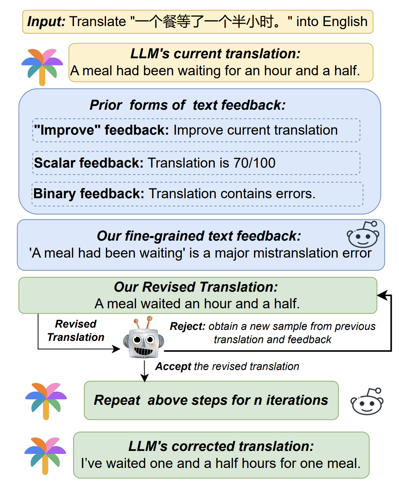

# Pinpoint, Not Criticize
This repository is dedicated to reproducing "Pinpoint, Not Criticize: Refining Large Language Models via Fine-Grained Actionable Feedback" ([Arxiv Link](https://arxiv.org/pdf/2311.09336.pdf)) with open-source LLMs.

<p align="center">
  
</p>

## Getting Started
You can set up environments for FITO and COMET (used for MT evaluation) using Conda as follows:
```
git clone https://github.com/xu1998hz/reproduce_pinpoint.git
cd reproduce_pinpoint
conda env create -f environment.yml
conda env create -f comet.yml
```
## How to Use
### Baseline LLM Performance
To evaluate the performance of baseline LLMs (currently supporting Llama 2 and Mistral) in Machine Translation, ASQA and summarization tasks, run the following bash scripts. The results are also available in the `out` directory.
```
cd run
./mt_run.sh
./qa_run.sh
./summ_run.sh
```
### Feedback Model
To fine-tune the Llama-7b model with fine-grained text feedback, run the following script. The checkpoint will be available for download soon.
```
cd run
./ft_run.sh
```
### Inference


